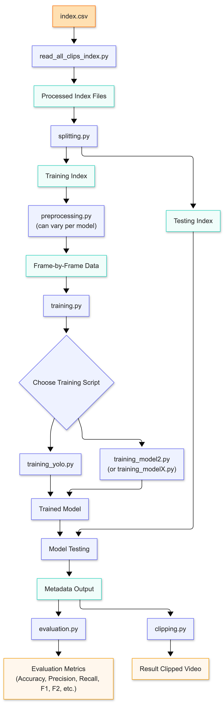

# MooVision

MooVision is a computer-vision pipeline for detecting **cross-sucking behaviour** in socially housed dairy calves from angled overhead pen video. The goal is to reduce the time and effort required for manual review/labeling by automatically producing candidate events, clipped video segments, and structured metadata for downstream analysis.

## Project Overview

Cross-sucking (here: sucking directed at various body parts of other calves) is a welfare concern in group-housed calves and is currently studied via manual labeling of long video recordings. This project builds a scalable workflow that:

- takes raw pen video as input
- runs a baseline detector (pretrained YOLOv8) with simple logic on top (e.g., proximity/overlap + temporal persistence)
- outputs predicted event windows and metadata (start/end time, confidence, pen, weaning stage, day)
- optionally generates clipped videos for review and evaluation

## Data Requirements (Data Collection)

- Data index file such as `all_clips_index.csv` listing cross-sucking clips, and associated data... WIP

## Repository Structure (high level)

- `src/`: library code (config, preprocessing, baseline inference, evaluation)
- `scripts/`: runnable entry points (run baseline, build clip index, etc.)
- `eda/`: EDA notebooks
- `tests/`: unit tests
- `docs/` : project documentation
- `report/`: report assets

## Environment Setup

This project uses `uv` for package management.

1. Install uv: `curl -LsSf https://astral.sh/uv/install.sh | sh`

2. Move into the folder where you wish to download the repo. Clone the repo.

    ```bash
    git clone git@github.com:UBC-AWP/mooVision.git
    ```

3. Cd into the repo.

    ```bash
    cd mooVision
    ```

4. Run `uv sync` to install all dependencies.

    ```bash
    uv sync
    ```

5. Run scripts with `uv run python <script.py>`

---

## Local `.env` configuration (required)

We use a local `.env` file (stored at the **repo root**) to configure machine-specific paths (e.g., where the video clips live). This avoids hardcoding absolute paths in code.

1. Create a `.env` file at the repo root:

   ```bash
   cp .env.example .env
   ```

2. Edit `.env` and set your local data path, for example:

   ```bash
   ROOT_DIR=/path/to/your/root/directory
   LOCAL_DIR=/path/to/your/local/directory
   ```

3. `.env` is ignored by git (do not commit). If you need to change what variables exist, update `.env.example` instead.

## OneDrive Sync

UBC offers OneDrive accounts for researchers and research groups. If your data is hosted on OneDrive you will need to sync your account to your local computer.

1. Download the OneDrive App.

2. Sign in with the email account connected to the OneDrive folder hosting your data. For UBC researchers this is your UBC email.

3. Follow the prompts to sync your folder. Alternatively, open OneDrive in your browser, move into the folder you want to sync, and click sync in the top toolbar.

---

## Configuring your repository in `config.py`

We use `config.py` to configure paths to video and label directories. By default, the config file is setup for source videos, cross-sucking clips, and annotation labels existing in the following data structure:

```plaintext
mooVision/
└── data/
    ├── raw_cross_sucking_datalog/
    │   └── videos/                          <- Raw field footages from cameras.
    │
    ├── cross_sucking_clips/                 <- Curated video segments containing cross-sucking events.
    │   └── all_clips_index.csv              <- Index file listing curated video segments containing cross-sucking events and associated metadata.
    │
    └── cross_sucking_labelled/              <- Ground-truth frames and splits as zipped files.
     
```

To configure the project for your data structure layout, change the following variables within the `config.py` module:

```plaintext
# Videos and labels
UNLABELLED_CLIPS_DIR = ROOT_DIR / "<cross_sucking_clips_folder>"
LABELLED_CLIPS_DIR = ROOT_DIR / "<cross_sucking_labels_folder>"
SOURCE_VIDEOS_DIR = ROOT_DIR / "<source_videos_folder>"
```

To change the location of your data index file, edit the following:

```plaintext
# Raw and Processed Index Paths
INDEX_PATH = Path/to/your/index/file/<file>
```

## Pipeline Diagram


## Running the Pipeline (demo)

After configuring you `.env` and config files, run the following commands from your terminal in the MooVision root directory to move through a local demo of the project workflow. For more information see, project documentation.

0. *Tip: You can run all steps below in one command with `make run`, or individual steps*

1. Read in Raw index, and process for videos . Note, this will throw a lot of warnings when ran. These are telling you that the function is using the clips NOT found in fixed_clips when multiple versions of the same video are found.

   ```bash
   uv run scripts/data_reading/read_all_clips_index.py --FORCE
   ```

2. Split Data into train and test splits. This outputs the 8 main train/val/test splits tested to the `data/processed/` folder within the root directory. For more information, see the project documentation.

   ```bash
   uv run scripts/data_splitting/split_data.py --force
   ```

3. Preprocess Data for fine-tuning YOLO object detection model (using demo training set). Note that the train_path, val_path, and output_path are relative to the root directory `ROOT_DIR` here. Here we run only the demo training set for efficiency purposes as running all 8 splits is a long process. A similar command can be used to run any of the other splits, for more information see project documentation.

   ```bash
   uv run scripts/preprocessing/preprocessing_yolo.py \
   --train_path="data/processed/pipeline_demo/train.csv" \
   --val_path="data/processed/pipeline_demo/val.csv" \
   --output_path="data/training/pipeline_demo/" \
   --skip=10 \
   --force
   ```

    Note: it might take a while to upload files to OneDrive if you have set your root directory there.

4. Train YOLO object detection model. Note: change `--device="cpu"` to 0 for GPU, `cuda` for CUDA GPU, 'mps' for Mac GPU, or "cpu" if no GPU available. Note the dataset size is small so training should not take long. This will save the model to `data/yolo_training_runs/project` in the root directory (OneDrive if setup that way). For more information see the project documentation.

   ```bash
   uv run scripts/training/training_yolo.py --dataset="data/training/pipeline_demo/dataset/dataset.yaml" --project="pipeline_demo" --name="demo_01" --device="cpu" --epochs=1 --batch=8
   ```

5. Run baseline on test videos to capture cross-sucking events and produce associated metadata:

    Cross-sucking examples (~2-3 minutes):

    ```bash
    uv run scripts/models/baseline/baseline.py --csv "data/processed/pipeline_demo/test.csv" --frame_skip 100
    ```

6. Load and Run fine-tuned YOLO model on demo video (2s buffer):

    ```bash
    uv run scripts/run_testing_2.py --model_path "data/yolo_training_runs/pipeline_demo/demo_01/weights/best.pt" --data_path "data/processed/pipeline_demo/test.csv" --chunk 0 --chunk_pct 1.0
    ```

    Note: if you wish to overwrite the existing result, add the argument `--overwrite` in the end

    ```bash
    uv run scripts/run_testing_2.py --model_path "data/yolo_training_runs/pipeline_demo/demo_01/weights/best.pt" --data_path "data/processed/pipeline_demo/test.csv" --chunk 0 --chunk_pct 1.0 --overwrite
    ```

7. Evaluate results, including frame-level bounding box IoU computed from CVAT annotations. Note that `--labelled_clips_dir` should point to the directory containing the CVAT annotation zip files for the clips being evaluated; this argument is optional and can be omitted if frame-level bbox IoU is not needed.

    Evaluate plain fine-tuned YOLO (CS detection only, no temporal linking):

    ```bash
    uv run python scripts/evaluation.py \
        --predictions "results/metadata/pipeline_demo/yolo/" \
        --ground_truth data/processed/processed_clips_index.csv \
        --output results/evaluation_report_yolo.json \
        --labelled_clips_dir "cross_sucking_labelled"
    ```

    Evaluate YOLO + Seq-NMS (with temporal linking):

    ```bash
    uv run python scripts/evaluation.py \
        --predictions "results/metadata/pipeline_demo/seq-nms/" \
        --ground_truth data/processed/processed_clips_index.csv \
        --output results/evaluation_report_seq_nms.json \
        --labelled_clips_dir "cross_sucking_labelled"
    ```

8. Clip frames from results:

   ```bash
   uv run scripts/clipping.py --input "results/metadata/pipeline_demo/yolo/ch02_20250913094601_results.json"
   ```
   
The distribution analysis notebook is not part of the `make run` pipeline and
should be run manually after any model stage to explore its outputs:

```bash
uv run jupyter notebook notebooks/distribution_analysis.ipynb
```

## Running the Full Pipeline (Sockeye HPC)

The demo workflow above is intended for local testing on a small subset of data. The actual research pipeline is run on [Sockeye](https://arc.ubc.ca/compute-storage/ubc-arc-sockeye), UBC's high-performance computing cluster, due to the size of the raw video data and the compute requirements of model training and inference.

**Data flow:**

1. **Raw data origin — OneDrive.** The original raw pen videos and annotation files are stored in a shared UBC OneDrive library. These were transferred to Sockeye's scratch storage prior to running the pipeline.

2. **Pipeline execution — Sockeye.** All computationally intensive steps (preprocessing, YOLO training, and inference on test data for both YOLO and Seq-NMS) are run on Sockeye via SLURM array jobs.

3. **Metadata Results — saved to both Sockeye and OneDrive.** Pipeline outputs (metadata) are saved to Sockeye scratch and synced back to the shared OneDrive library so the full team can access results in the future.

For a summary of findings, see the [final report](placeholder_path).

> **Note for Sockeye users:** See the Sockeye documentation in the MkDocs for more information.

## How to run MkDocs
For detailed documentation, please refer to our MkDocs site. To view it locally, run:
   ```bash
   uv run mkdocs serve
   ```

## Gemini API Configuration

This project requires a Gemini API key to run multimodal inference via the `google-genai` SDK.

### 1. Generate Your Key
1. Navigate to **[Google AI Studio](https://aistudio.google.com/)**.
2. Sign in using your Google developer account.
3. Click the **Get API Key** button in the dashboard interface.
4. Select or create a project workspace, click **Create API Key**, and copy the string (it will start with `AIzaSy`).

### 2. Configure Environment Variables
Create a `.env` file in the root directory of your project (or open your existing one) and add your copied key variable:

```env
GEMINI_API_KEY="YOUR_API_KEY_HERE"
