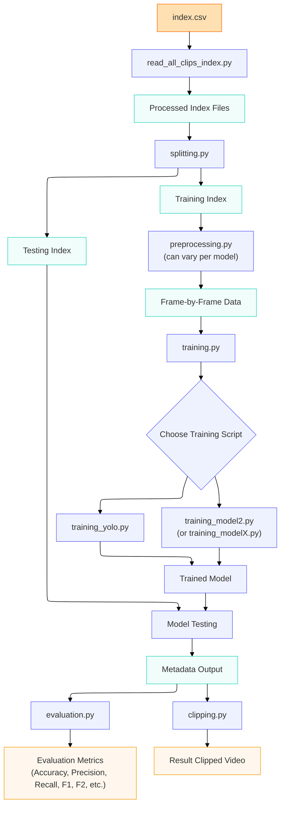

# MooVision

MooVision is a computer-vision pipeline for detecting cross-sucking behaviour in socially housed dairy calves from angled overhead pen video. The goal is to reduce the time and effort required for manual review/labeling by automatically producing candidate events, clipped video segments, and structured metadata for downstream analysis.

---

## Project Overview

Cross-sucking (a calf sucking directed at various body parts of another calf) is a welfare concern in group-housed calves and is currently studied via manual labeling of long video recordings. This project builds a scalable workflow that:

* Takes raw pen videos as input
* Runs a baseline detector (pretrained YOLOv8) with simple logic on top (e.g., proximity/overlap + temporal persistence)
* Outputs predicted event windows and metadata (start/end time, confidence, pen, weaning stage, day)
* Optionally generates clipped videos for review and evaluation

## Project layout

```text
mooVision/
├── docs/                     # Markdown files compiled by MkDocs into your static site
│   ├── index.md              # The documentation homepage
│   ├── ...                   
├── scripts/                  # Executable pipeline source code directories
│   ├── read_data/            # Read the data 
│   ├── split_data/           # Split the data 
│   ├── preprocessing/        # Preprocess data
│   ├── training/.            # Training models
│   ├── run_models/           # Scripts to run models on testing set
│   │   └── baseline/         
│   │   └── seq_NMS/         
│   │   └── yolo/         
│   │   └── run_testing.py    # For running fine-tuned YOLO model and Seq-NMS on test data
│   └── evaluation/
│   └── clipping    
├── tests/                    # Robust test suite validating code integrity
│   └── ...        
├── utils/                    # Supportive pipeline utility scripts
│   ├── build_clip_index.py   # Synchronizes dataset manifestations
│   ├── clip_frames_mp4s.py   # Baseline target image slicing utility
│   ├── count_labelled_clips.py # Audits dataset representation balances
│   ├── count_mp4s.py         # Validates physical cluster storage arrays
│   ├── extract_frames.py     # Multiprocessed image unpacking and tracking overlay
│   └── get_video.py          # Programmatic OpenCV stream verification tools
├── scripts_sockeye/          # Bash scripts to run in Sockeye
│   ├── 01_setup.sh           
│   ├── 02_read_and_split.sh  
│   ├── 03_preprocessing.sh   
│   ├── 04_train_yolo.sh      
│   ├── 05_baseline_testing.sh
│   ├── 06_yolo_testing.sh    
│   ├── 07_baseline_eval.sh   
│   └── 08_yolo_evaluation.sh
├── config.py                 # Master configuration file containing path definitions
├── mkdocs.yml                # Configuration file defining MkDocs plugins and themes
├── pyproject.toml            # Project dependency definitions managed via uv
├── reports/                  # Project proposal and final report
├── Makefile                  # Makefile to run the whole pipeline locally
└── run_training_pipeline.sh  # For running the whole pipeline in Sockeye
```

## Pipeline Diagram



For full documentation visit [mkdocs.org](https://www.mkdocs.org).
