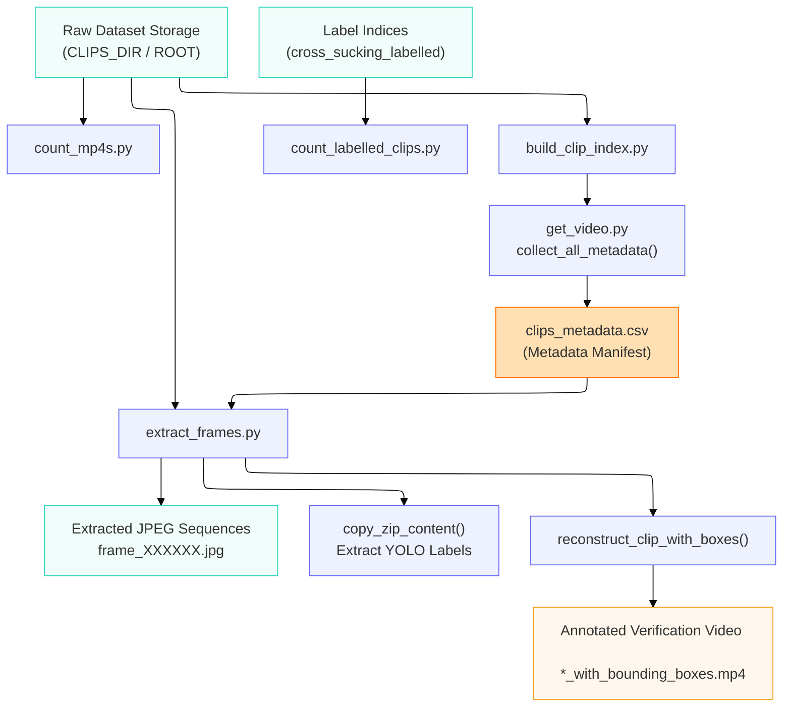

# Repository Utilities Reference Guide (`utils/`)

This reference manual documents the supportive script ecosystem located in the `utils/` directory. These modules handle dataset metrics reporting, video asset pipeline metadata parsing, directory auditing, frame extraction, and ground-truth bounding box visualization.

---

## Technical Pipeline Architecture

The scripts inside `utils/` bridge raw storage tracking domains with structural metadata definitions and dataset extraction layers.

---

## 1. Metadata Generation & Synchronization

### `build_clip_index.py`

* **Functional Logic:** Orchestrates the master manifest build sequence. It automatically sweeps the `CLIPS_DIR` folder via `collect_all_metadata` using a default `'Pen'` matching strategy context. It compares physical filesystem items found by `rglob` against files successfully parsed by OpenCV to evaluate dataset sanity metrics.
* **Outputs:** * Successful dataset logs save to `clips_metadata.csv`.
* Corrupted or unreadable tracks are written out to `failed_clips.txt`.

::: utils.build_clip_index
    options:
      show_root_heading: false
      show_source: true

---

### `get_video.py`

* **Functional Logic:** Implements programmatic video verification routines using OpenCV streaming wrappers.
* `get_video_info()`: Robustly reads `FPS` and `FRAME_COUNT` constants. It unpacks deep folder indices to automatically parse descriptive categorical properties (`pen`, `weaning_stage`, `day`) from path components. Includes an integrated attempt loop to gracefully handle transient reading lag.
* `collect_all_metadata()`: Gathers eligible elements by tracking targeted matching constraints (`"Pen"` or `"Test"`) across folders.

::: utils.get_video
    options:
      show_root_heading: false
      show_source: true

---

## 2. Dataset Auditing & Validation

### `count_mp4s.py`

* **Functional Logic:** Performs a complete traversal beneath your configured environment `ROOT` path. It tallies any raw `.mp4` video segments on disk and prints an indexed folder chart directly to the console.

::: utils.count_mp4s
    options:
      show_root_heading: false
      show_source: true

---

### `count_labelled_clips.py`

* **Functional Logic:** Audits annotation dataset balances. It searches target storage tracks recursively for compressed labels (`*.zip`) and renders nested branch totals to monitor representation tracking across classes.

::: utils.count_labelled_clips
    options:
      show_root_heading: false
      show_source: true

---

## 3. Preprocessing & Ground-Truth Verification

### `extract_frames.py`

* **Functional Logic:** An integrated data preparation and visualization pipeline module:
1. **Frame Unpacking:** Unrolls raw `.mp4` clips into subfolders containing sequential, zero-padded image frames (`frame_000000.jpg`).
2. **Label Extraction (`copy_zip_content`):** Cross-references video items inside `processed_clips_index.csv`, locates the compressed annotated source zip archives, replaces backslashes to resolve cross-platform directory break failures, and safely extracts corresponding coordinate files (`frame_*.txt`) into the workspace.
3. **Ground-Truth Rendering (`reconstruct_clip_with_boxes`):** Sequentially reads frame streams and YOLO label files, converts normalized ratio box metrics back into absolute image pixel dimensions, overlays bright red bounding frames tagged `"cross-sucking"`, and compiles the final verification tracking reference clip (`*_with_bounding_boxes.mp4`).

::: utils.extract_frames
    options:
      show_root_heading: false
      show_source: true

---

### `clip_frames_mp4s.py`

* **Functional Logic:** A rapid local scripting sandbox utility. It extracts the first few initial frames from a configured target video sequence and dumps them directly into your project Exploratory Data Analysis space (`../EDA/frames`) as standalone `.png` files for checking alignment configurations.

::: utils.clip_frames_mp4s
    options:
      show_root_heading: false
      show_source: true
