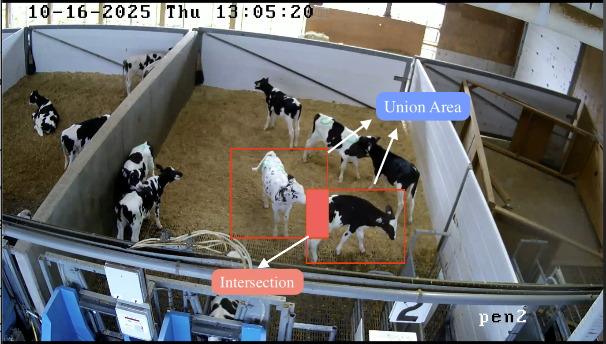
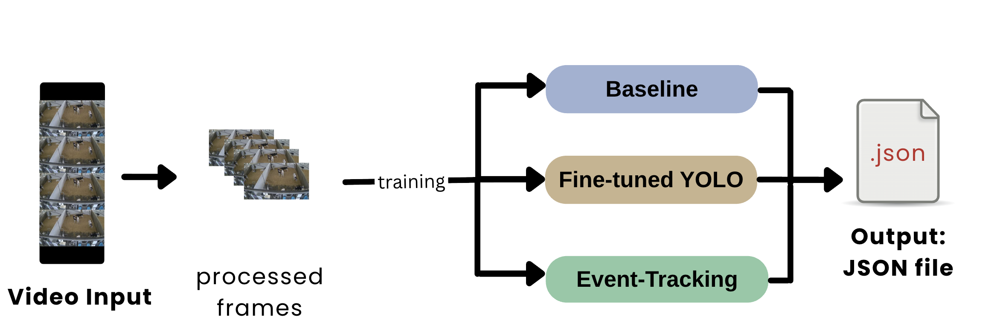



# Executive Summary

Dairy calves are typically separated from their mothers shortly after birth, and efforts to improve welfare through social housing are often limited by farmers' concerns about cross-sucking; a behaviour in which one calf sucks on the body parts of another, leading to injury, disease transmission, and reduced future milk production. With Canada’s update Code of Practice for Dairy Cattle requiring all indoor-housed calves to be socially housed by 4 weeks of age beginning April 1. 2031 [@weary2025social], addressing cross-sucking has become increasingly urgent. Research on cross-sucking is constrained by reliance on manual behavioural annotation, a process that is labour-intensive and difficult to scale. This project develops a computer-vision pipeline that automatically detects cross-sucking events in continuous barn camera footage, producing structured outputs: event timestamps, confidence scores, and bounding box coordinates, that directly reduce the manual annotation burden. Three approaches were evaluated: a pretrained YOLO26 baseline, a fine-tuned YOLO26 detector, and the fine-tuned detector extended with Sequential Non-Maximum Suppression (Seq-NMS). Seq-NMS detected more candidate cross-sucking events than YOLO26 alone in both test periods (Postwean: 820 vs. 238; Wean: 6,842 vs 554), though overall recall remained very low, with data volume identified as the primary bottleneck to further improvement.


# Introduction

In modern dairy farms, calves are often separated from their mothers within hours of birth [@mahmoud2016impacts; @wegner2025suckling] and housed individually [@gaillard2014]. Although individual housing may be easier to manage, social housing has been shown to improve calf welfare, including enhanced social cognition, cognitive development, learning ability, and reduced weaning distress [@plaugher2025]. Despite these benefits, many farmers remain reluctant to adopt social housing due to concerns surrounding cross-sucking [@plaugher2025].

Cross-sucking occurs when calves suck on the body parts of another calf, and in this project is defined specifically as sucking directed at the udder area. This behaviour emerges because calves are unable to satisfy their natural suckling instinct following mother–calf separation and therefore redirect this behaviour toward one another [@wegner2025suckling]. Cross-sucking can lead to physical injuries, disease transmission, and long-term reductions in future milk production [@mahmoud2016impacts], reinforcing concerns around social housing systems.

Currently, the UBC Animal Welfare Program (AWP) relies on manual labelling of extensive calf video recordings to study cross-sucking behaviour. This process is time-consuming, labour-intensive, and subject to inconsistencies between annotators, making it difficult to scale to larger datasets in commercial farming environments. This project aims to develop an affordable, automated system capable of detecting cross-sucking from continuous pen video, enabling more efficient, consistent, and scalable analysis of dairy calf behaviour in social housing systems.

Over the course of the project, the original objective was refined into four clear and measurable components:

- Develop a detection model that identifies cross-sucking behaviour in raw video through spatial localization using bounding boxes.
- Implement a temporal linking method that groups frame-level detections into coherent behavioural events with defined start and end times.
- Design an evaluation framework that assesses both the spatial accuracy of bounding box predictions and the temporal accuracy of event detection.
- Build an end-to-end pipeline that processes raw video and outputs structured metadata, including event timestamps, confidence scores, and bounding box coordinates, enabling use by non-technical users in research and farm environments.

The pipeline evaluates model performance at two levels. Frame-level evaluation looks at individual frames and asks whether the model's predicted bounding boxes line up spatially with the real, annotated cross-sucking regions. Event-level evaluation looks at entire cross-sucking events and asks whether the model detected them at roughly the right time, producing precision, recall, and F1/F2 scores. 

Together, these objectives address the partner’s core need: a scalable, automated tool that reduces the manual annotation burden while producing outputs that directly support behavioural research questions about when and how frequently cross-sucking occurs across different housing conditions and developmental stages. 


# Data 

## Experimental Data Splits

To evaluate generalisation across deployment scenarios, the dataset was partitioned into eight train/validation splits across four experimental conditions. @tbl-splits summarises each split type, the number of models trained, and the research question each addresses.

```{python}
#| label: tbl-splits
#| tbl-cap: "Experimental train/test split design"

import pandas as pd
from IPython.display import display

splits = pd.DataFrame({
    "Split Type":        ["Random", "Time-based", "Pen-based", "Period-based"],
    "Models Trained":    [1, 1, 3, 3],
    "Research Question": [
        "How well does the model perform when train and test come from the same distribution?",
        "How well does the model generalise to unseen days in a known environment?",
        "How well does the model transfer to a new physical environment?",
        "How well does the model generalize across calf developmental stage?",
    ]
})
display(splits.style.hide(axis="index"))
```


# High-Performance Computing (HPC) Workflow & Preprocessing Challenges

Due to the size of our dataset, and the running of multiple experiments, we used UBC ARC Sockeye - UBC’s High-Performance Computing Cluster (HPC) - to gain significant computing power and parallelization for our training pipelines. However, training YOLO models requires videos and annotation folders to be unpacked into sets of many individual frames and labels. This posed a unique challenge as HPC systems struggled severely when forced to transfer large numbers of small files. To solve this issue, our pipeline splits into two workflows. This influenced our preprocessing workflows to include two segments: one for handling files on sockeye, and one for handling preprocessing locally. On sockeye, we ran our pipeline in parallel, allowing us to significantly reduce computing time and train models for each of our experiments simultaneously. This reduces the timeframe for running all experiments from multiple weeks to ~2 days. Full operational details are provided in @sec-appendix-sockeye.


# Data Science Methods

## A. Baseline

The first priority was establishing a functioning baseline pipeline. The baseline uses [YOLO26](https://docs.ultralytics.com/models/yolo26) pre-trained on the [COCO dataset](https://docs.ultralytics.com/datasets/detect/coco) to detect calves and draw bounding boxes in each frame. For each frame, we compute the Intersection over Union (IoU) between every detected pair, as illustrated in @fig-baseline-iou. If any pair exceeds the minimum IoU threshold for at least a minimum duration, it is saved as a cross-sucking event; shorter sequences are discarded as noise.

{#fig-baseline-iou width=60%}

This approach is deliberately naive, using proximity as a proxy for cross-sucking with no understanding of what the behaviour actually looks like. Its value lies not in accuracy but in providing a reference point against which fine-tuned model improvements can be measured.

## B. Fine-tuned YOLO Model

To move beyond proximity detection, we fine-tuned the pre-trained YOLO model on our labelled cross-sucking data. Rather than detecting any close contact between calves, the model is trained to recognize the specific visual patterns that characterize cross-sucking, the particular postures and spatial configurations that distinguish it from other interactions. This significantly improves detection precision over the baseline. 

However, YOLO is an object detector, not an action/behaviour recognizer. It processes each frame independently and has no memory of what came before, which creates a distinct challenge: spatial detection without temporal context. YOLO learns what cross-sucking looks like in a single frame, but cross-sucking is a behaviour that unfolds over time. A model with no temporal awareness may miss events that are only recognizable across multiple frames or produce inconsistent detections across a sequence (i.e. fragmented event tracking). 

## C. YOLO and Seq-NMS

YOLO26 with Sequential Non-Maximum Suppression (Seq-NMS) extends the fine-tuned YOLO approach by adding a temporal linking component. While the fine-tuned YOLO model detects cross-sucking behaviour at the frame level, it has no memory of what happened in previous frames. This means a single cross-sucking event is represented as hundreds of disconnected single-frame detections. Seq-NMS addresses this by linking spatially overlapping detections across consecutive frames into coherent event tubes with defined start and end times, and filtering out tubes shorter than a minimum duration to reduce noise. This approach was preferred over more complex tracking algorithms because it is simpler, computationally lightweight, and produces outputs that map directly onto our ground truth annotation format.

A key limitation is that Seq-NMS performance depends heavily on the quality of per-frame detections. With limited training data and few epochs, noisy detections can cause missed events, which is reflected in the low recall that was observed in preliminary results. Another limitation is that Seq-NMS links detections based purely on spatial overlap between consecutive frames. If two calves shift position during a cross-sucking interaction, the bounding box location changes significantly enough that Seq-NMS may break the tube and treat this as two separate events. This could inflate event counts and reduce measured event durations.

## D. Preliminary experiment with LLM Gemini

As a parallel experiment, Google Gemini 2.5 Flash was evaluated as a zero-shot multimodal detector to assess whether a large vision-language model could bypass the annotation bottleneck constraining supervised approaches. Two input modalities were tested: direct video input and frame-by-frame image input. Video input was identified as operationally superior, as each API call consumes the same quota unit regardless of clip length, making frame-by-frame processing unviable at barn surveillance scale. The prompt enforced a narrow behavioural definition requiring visible oral-to-hindquarter contact, explicitly excluding ear-sucking, social licking, and proximity without contact (full prompt in @sec-appendix-gemini).

# Data Product

{#fig-pipeline width=100%}

When deployed by a researcher or farm operator, the pipeline takes raw barn camera footage as input and requires no manual annotation or model training. The footage is passed directly through the detection model, which produces per-frame bounding box predictions. These are then aggregated into discrete cross-sucking events with defined start and end times using the temporal linking step. The resulting detections are written to structured JSON metadata files, one per source video, containing event timestamps, confidence scores, and bounding box coordinates. An automated clip extraction tool then uses these outputs to pull and organise flagged video segments by pen, weaning stage, and recording day, giving researchers a condensed set of candidate clips for human review rather than hours of continuous footage.

The current pipeline offers three detection configurations of increasing sophistication, the COCO-pretrained proximity baseline, the fine-tuned YOLO26 detector, and the fine-tuned detector extended with Seq-NMS temporal linking. The research pipeline used to develop and evaluate these models on UBC ARC Sockeye is documented separately in the project repository and is not required for deployment.

This JSON-first, modular architecture was chosen because the research context demands interpretability over automation. Researchers need to verify detections rather than simply trust them, and the structured output gives them enough signal to prioritise which clips warrant immediate review based on confidence and duration. The annotated bounding box overlays further aid this process by making visible exactly what the model was responding to in each flagged segment, supporting a human-in-the-loop review workflow that fits naturally into the AWP's existing annotation practices.


# Results

## Prediction Summary

```{python}
#| label: tbl-summary
#| tbl-cap: "Event-level detection statistics across splits and models"

import json
import re 
import pandas as pd
import altair as alt
from pathlib import Path
import sys

project_root = Path().resolve().parent.parent
sys.path.insert(0, str(project_root))
from config import ROOT_DIR

alt.data_transformers.enable("vegafusion")

EVAL_PATH = ROOT_DIR / "results" / "evaluation"

YOLO_MODEL_OUTPUT_DIR_PERIOD_POST = ROOT_DIR / "results" / "metadata" / "period_based" / "POSTWEAN" / "yolo"
YOLO_MODEL_OUTPUT_DIR_PERIOD_WEAN = ROOT_DIR / "results" / "metadata" / "period_based" / "WEAN"     / "yolo"
SEQ_MODEL_OUTPUT_DIR_PERIOD_POST  = ROOT_DIR / "results" / "metadata" / "period_based" / "POSTWEAN" / "seq-nms"
SEQ_MODEL_OUTPUT_DIR_PERIOD_WEAN  = ROOT_DIR / "results" / "metadata" / "period_based" / "WEAN"     / "seq-nms"
YOLO_MODEL_OUTPUT_DIR_RANDOM      = ROOT_DIR / "results" / "metadata" / "random"       / "yolo"
SEQ_MODEL_OUTPUT_DIR_RANDOM       = ROOT_DIR / "results" / "metadata" / "random"       / "seq-nms"

SPLITS = {
    "POSTWEAN": {"YOLO": YOLO_MODEL_OUTPUT_DIR_PERIOD_POST, "Seq-NMS": SEQ_MODEL_OUTPUT_DIR_PERIOD_POST},
    "WEAN":     {"YOLO": YOLO_MODEL_OUTPUT_DIR_PERIOD_WEAN, "Seq-NMS": SEQ_MODEL_OUTPUT_DIR_PERIOD_WEAN},
    "Random":   {"YOLO": YOLO_MODEL_OUTPUT_DIR_RANDOM,      "Seq-NMS": SEQ_MODEL_OUTPUT_DIR_RANDOM},
}
SPLIT_ORDER = ["POSTWEAN", "WEAN", "Random"]
MODEL_ORDER = [f"{m} — {s}" for s in SPLIT_ORDER for m in ["YOLO", "Seq-NMS"]]

def _extract_pen(video_path):
    m = re.search(r"Pen\s*(\d+)", video_path, re.IGNORECASE)
    return f"Pen {m.group(1)}" if m else "Unknown"

def _extract_stage(video_path):
    for stage in ("PREWEANING", "WEANING", "POSTWEANING"):
        if stage.lower() in video_path.lower():
            return stage
    return "Unknown"

def load_predictions(input_dir, model_label):
    video_rows, event_rows = [], []
    for path in sorted(Path(input_dir).glob("*.json")):
        with open(path) as f:
            data = json.load(f)
        vid   = data["identifier"]
        pen   = _extract_pen(data.get("video_path", ""))
        stage = _extract_stage(data.get("video_path", ""))
        video_rows.append({
            "model": model_label, "video": vid, "pen": pen,
            "weaning_stage": stage,
            "total_duration_sec": data.get("total_duration_sec"),
            "cross_sucking_detected": data.get("cross_sucking_detected", False),
            "num_events": data.get("num_events", 0),
        })
        for i, ev in enumerate(data.get("events", [])):
            event_rows.append({
                "model": model_label, "video": vid, "pen": pen,
                "weaning_stage": stage, "event_idx": i,
                "start_sec": ev["start_sec"], "end_sec": ev["end_sec"],
                "duration_sec": ev["duration_sec"], "avg_confidence": ev["avg_confidence"],
            })
    video_df = pd.DataFrame(video_rows)
    event_df = pd.DataFrame(event_rows) if event_rows else pd.DataFrame(
        columns=["model","video","pen","weaning_stage","event_idx",
                 "start_sec","end_sec","duration_sec","avg_confidence"])
    return video_df, event_df

video_dfs, event_dfs = [], []
for split_name, models in SPLITS.items():
    for model_label, path in models.items():
        if not path or not Path(path).exists():
            continue
        vdf, edf = load_predictions(path, model_label)
        vdf["split"] = split_name
        edf["split"] = split_name
        video_dfs.append(vdf)
        event_dfs.append(edf)

all_video_df = pd.concat(video_dfs, ignore_index=True)
all_event_df = pd.concat(event_dfs, ignore_index=True)
all_event_df["model_split"] = all_event_df["model"] + " — " + all_event_df["split"]
all_video_df["model_split"] = all_video_df["model"] + " — " + all_video_df["split"]
all_event_df["short_name"]  = all_event_df["video"].str.replace(r"\.mp4$", "", regex=True)
all_video_df["short_name"]  = all_video_df["video"].str.replace(r"\.mp4$", "", regex=True)

# ── Evaluation data ────────────────────────────────────────────────────────
def _parse_filename(filename):
    stem = Path(filename).stem
    m = re.match(r"evaluation_report_(.+?)_(yolo|seq_nms)$", stem)
    if not m:
        return {"split": stem, "model": "unknown"}
    return {"split": m.group(1), "model": m.group(2)}

def load_evaluation_folder(folder):
    rows = []
    for jf in sorted(Path(folder).glob("*.json")):
        with open(jf) as f:
            data = json.load(f)
        meta  = _parse_filename(jf.name)
        ev    = data.get("event_level", {})
        seq   = data.get("sequence_level", {})
        frame = data.get("frame_level", {})
        rows.append({
            "split":            meta["split"],
            "model":            meta["model"],
            "TP":               ev.get("true_positives",  0),
            "FP":               ev.get("false_positives", 0),
            "FN":               ev.get("false_negatives", 0),
            "precision":        ev.get("precision",  0.0),
            "recall":           ev.get("recall",     0.0),
            "f2":               ev.get("f2",         0.0),
            "avg_temporal_iou": seq.get("avg_temporal_iou", 0.0),
            "frame_bbox_iou":   frame.get("avg_bbox_iou",   0.0),
        })
    return pd.DataFrame(rows).sort_values(["split", "model"]).reset_index(drop=True)

eval_df = load_evaluation_folder(EVAL_PATH)

# ── Summary table from all_event_df ───────────────────────────────────────
summary = (
    all_event_df
    .groupby(["split", "model"])
    .agg(
        Events=("event_idx", "count"),
        Conf_Mean=("avg_confidence", "mean"),
        Conf_Std=("avg_confidence", "std"),
        Dur_Mean=("duration_sec", "mean"),
        Dur_Std=("duration_sec", "std"),
    )
    .round(3)
    .reset_index()
    .rename(columns={
        "split": "Split", "model": "Model",
        "Conf_Mean": "Conf. Mean", "Conf_Std": "Conf. Std",
        "Dur_Mean": "Dur. Mean (s)", "Dur_Std": "Dur. Std (s)",
    })
)

summary.style.hide(axis="index").format({
    "Conf. Mean": "{:.3f}", "Conf. Std": "{:.3f}",
    "Dur. Mean (s)": "{:.3f}", "Dur. Std (s)": "{:.3f}",
})
```

@tbl-summary summarises predicted event counts, mean confidence, and mean duration across splits and models. Three patterns are consistent across all splits. First, Seq-NMS predicts substantially more events than YOLO in every split: 820 vs 238 in POSTWEAN, 434 vs 162 in Random, and 6,842 vs 554 in WEAN. Second, Seq-NMS events are much shorter on average than YOLO events; in POSTWEAN for example, mean duration is 11.4s for Seq-NMS compared to 49.2s for YOLO. Third, both effects are most pronounced in the WEAN split, where Seq-NMS generates over 12 times more events than YOLO at the shortest mean duration (7.0s), while YOLO produces its longest mean events (131.3s). This is consistent with the Seq-NMS sequence-linking step breaking up what YOLO treats as one long sustained detection into many shorter linked segments, and suggests the WEAN period, where calves are in closer and more frequent proximity, is particularly prone to this behaviour.

## Confusion Matrix

```{python}
#| label: fig-confusion
#| fig-cap: "Event-level confusion matrix by model and split. True negatives are excluded as they are not well-defined at the event level for continuous video."

rows = []
for _, meta in eval_df.iterrows():
    split_label = meta["split"].upper()
    model_label = "YOLO" if meta["model"] == "yolo" else "Seq-NMS"
    ms = f"{model_label} — {split_label}"
    rows.extend([
        {"model_split": ms, "Actual": "CS",    "Predicted": "CS",    "n": int(meta["TP"]), "cell": "TP"},
        {"model_split": ms, "Actual": "No CS", "Predicted": "CS",    "n": int(meta["FP"]), "cell": "FP"},
        {"model_split": ms, "Actual": "CS",    "Predicted": "No CS", "n": int(meta["FN"]), "cell": "FN"},
    ])
cm_df = pd.DataFrame(rows)

alt.data_transformers.enable("default")
alt.data_transformers.disable_max_rows()

_base = alt.Chart(cm_df).encode(
    alt.X("Predicted:N", sort=["CS", "No CS"],
          axis=alt.Axis(labelAngle=0), title="Predicted"),
    alt.Y("Actual:N", sort=["CS", "No CS"], title="Actual"),
)
_rect = _base.mark_rect().encode(
    alt.Color("n:Q", scale=alt.Scale(scheme="blues"), title="Count"),
    tooltip=["model_split:N", "cell:N", "n:Q"],
)
_text = _base.mark_text(fontSize=18, fontWeight="bold").encode(
    alt.Text("n:Q"),
    color=alt.condition("datum.n > 30", alt.value("white"), alt.value("black")),
)
fig_confusion = (
    (_rect + _text)
    .properties(width=130, height=130)
    .facet(facet=alt.Facet("model_split:N", sort=MODEL_ORDER), columns=3)
)
alt.data_transformers.enable("vegafusion")
fig_confusion
```

@fig-confusion reveals the dominant failure mode: across every split and model, the vast majority of confirmed cross-sucking events are predicted as No CS, with true positive counts ranging from 0 to 9 out of 1,100 ground truth events. This confirms that both models are missing nearly all genuine cross-sucking occurrences rather than mislabelling other behaviours as cross-sucking.

Seq-NMS consistently recovered more true positives than YOLO in splits with confirmed signal, 9 vs 3 in POSTWEAN and 5 vs 1 in WEAN, confirming that temporal linking adds genuine recall value, but at a precision cost that is currently too high for unsupervised deployment (POSTWEAN: 193 vs 27 false positives; WEAN: 569 vs 18). Across all split types, neither model demonstrated reliable generalisation, whether to unseen days, new pen environments, or different developmental periods, suggesting that the limiting factor is not the experimental condition but the amount of labelled training data available.

That said, the project successfully delivered a functional end-to-end pipeline capable of processing raw barn video, applying frame-level detection, implementing temporal event linking, and producing structured JSON outputs with timestamps, confidence scores, and bounding box coordinates, directly addressing the AWP's need for a scalable and interpretable annotation tool.

## Temporal Analysis

```{python}
#| label: fig-temporal-postwean
#| fig-cap: "Temporal density of predicted events within videos — POSTWEAN split. Dot size encodes event duration; colour encodes confidence."

alt.data_transformers.enable("vegafusion")

def _temporal_chart(ms, width=500):
    df = all_event_df[all_event_df["model_split"] == ms].copy()
    n  = df["video"].nunique()
    return (
        alt.Chart(df, title=ms)
        .mark_point(filled=True, opacity=0.75)
        .encode(
            alt.X("start_sec:Q", title="Start Time (s)"),
            alt.Y("short_name:N", title="Video", sort="-x"),
            alt.Size("duration_sec:Q", title="Duration (s)",
                     scale=alt.Scale(range=[10, 220])),
            alt.Color("avg_confidence:Q",
                      scale=alt.Scale(scheme="viridis"),
                      title="Confidence"),
            tooltip=["short_name:N", "start_sec:Q", "end_sec:Q",
                     "duration_sec:Q", "avg_confidence:Q",
                     "pen:N", "weaning_stage:N"],
        )
        .properties(width=width, height=max(240, n * 20))
    )

alt.vconcat(
    _temporal_chart("YOLO — POSTWEAN"),
    _temporal_chart("Seq-NMS — POSTWEAN"),
)
```

```{python}
#| label: fig-temporal-wean
#| fig-cap: "Temporal density of predicted events within videos — WEAN split."

alt.vconcat(
    _temporal_chart("YOLO — WEAN"),
    _temporal_chart("Seq-NMS — WEAN"),
)
```

```{python}
#| label: fig-temporal-random
#| fig-cap: "Temporal density of predicted events within videos — Random split."

alt.vconcat(
    _temporal_chart("YOLO — Random"),
    _temporal_chart("Seq-NMS — Random"),
)
```

@fig-temporal-postwean, @fig-temporal-wean, and @fig-temporal-random show that across all splits, both models fire detections broadly across video timelines with no clear clustering around genuine behavioural bouts. The WEAN split is the most severely affected, with Seq-NMS generating 6,842 events, roughly 8 times the POSTWEAN count, at the lowest mean confidence (0.32) and shortest mean duration (7.0s), consistent with the linking step connecting many short detections during a period when calves are in closer and more frequent physical contact. The random split reinforces this interpretation, with zero confirmed true positives for either model and confidence distributions closely matching those of splits with genuine cross-sucking signal. Taken together, these results suggest the model has learned to detect generic calf proximity rather than cross-sucking behaviour specifically, firing with similar confidence whether or not a genuine event is present and failing to concentrate detections around the moments when cross-sucking actually occurs.

## Limitation


# Conclusions and Recommendations




# Appendix {#sec-appendix}

## Glossary of Terms {#sec-appendix-glossary}

**Cross-sucking event:** A single, continuous occurrence of cross-sucking behaviour performed by a calf, as identified and labelled by a human annotator. Each event has a defined start and end time within a source video.

**Event window:** The time interval defined by a start and end time (in seconds) over which a cross-sucking event occurs, applying to both ground truth and predicted events.

**Frame:** A single still image extracted from a video at a specific point in time.

**Frame-level detection:** A bounding box predicted by the model on an individual video frame indicating the location of a calf engaged in cross-sucking behaviour.

**Bounding box:** A rectangular region defined by pixel coordinates that marks the location of a cross-sucking interaction within a single frame.

**Frame-level evaluation:** Comparison of predicted bounding boxes against ground truth bounding boxes on a frame-by-frame basis, measuring spatial accuracy.

**Event-level evaluation:** Comparison of entire predicted event windows against ground truth event windows, measuring temporal detection accuracy and producing precision, recall, F1, and F2 scores.

**True positive:** A predicted event whose time window sufficiently overlaps with a labelled ground truth event.

**False positive:** A predicted event that does not correspond to any labelled ground truth event.

**False negative:** A labelled ground truth event that the model failed to detect.

**Ground truth:** The set of human-annotated cross-sucking events and bounding boxes treated as the correct reference for evaluation.

## Preprocessing on Sockeye {#sec-appendix-sockeye}

On Sockeye preprocessing jobs are split across multiple nodes and run in parallel. For each one, video frames and labels are extracted locally on compute nodes, packaged into datasets, and then transferred to a data storage node (in the scratch directory) as compressed tar files before being transferred back and unpacked on compute nodes as training sets. This avoids the issue of transferring small files and makes use of the high-speed transfer system for large files, ensuring an efficient and timely workflow. Training and evaluation then follow, also split across several nodes to ensure we make use of Sockeye’s cluster system.

In the local workflow, splits must be run in sequential order as functionality for parallelization has not been added. However, data is sent straight to the predesignated root directory, and avoids the need to compress and uncompress a dataset within the same device. Subsequent training and evaluation must be run sequentially as well.


## Gemini 2.5 Flash Prompt {#sec-appendix-gemini}

```python
CROSS_SUCKING_VIDEO_PROMPT = (
    "You are an expert in dairy cattle behaviour. Identify cross-sucking in this video. "
    "Cross-sucking is defined narrowly here: one calf sucking on the hind/rear back, udder, "
    "or lower stomach/belly area of another calf. It requires visible oral contact between one "
    "calf's mouth and that hindquarter region of another calf. Do NOT count sucking on any other "
    "body part (ears, muzzle, legs, etc.), and do NOT count mere proximity, sniffing, head-butting, "
    "or social licking. Analyse the video systematically. For every timestamp where cross-sucking "
    "occurs, return a 2D bounding box that encloses the event. Respond ONLY with a JSON array. "
    "Each element MUST include: [{\"timestamp_sec\": <float>, \"label\": \"cross-sucking\", "
    "\"box_2d\": [ymin, xmin, ymax, xmax]}]. If cross-sucking does not occur, return []."
)

IMAGE_CROSS_SUCKING_PROMPT = (
    "You are an expert in dairy cattle behaviour. Identify cross-sucking in this image. "
    "Cross-sucking is defined narrowly here: one calf sucking on the hind/rear back, udder, "
    "or lower stomach/belly area of another calf. It requires visible oral contact between one "
    "calf's mouth and that hindquarter region of another calf. Do NOT count sucking on any other "
    "body part (ears, muzzle, legs, etc.), and do NOT count mere proximity, sniffing, "
    "head-butting, or social licking. If cross-sucking clearly occurs, return one tight 2D "
    "bounding box that encloses both the calf doing the sucking AND the hind/udder/stomach area "
    "being sucked, with the label 'cross-sucking'. Respond ONLY with a JSON array — no markdown, "
    "no explanation: [{\"label\": \"cross-sucking\", "
    "\"box_2d\": [ymin, xmin, ymax, xmax]}]. "
    "If cross-sucking does not clearly occur in the image, return []."
)
```