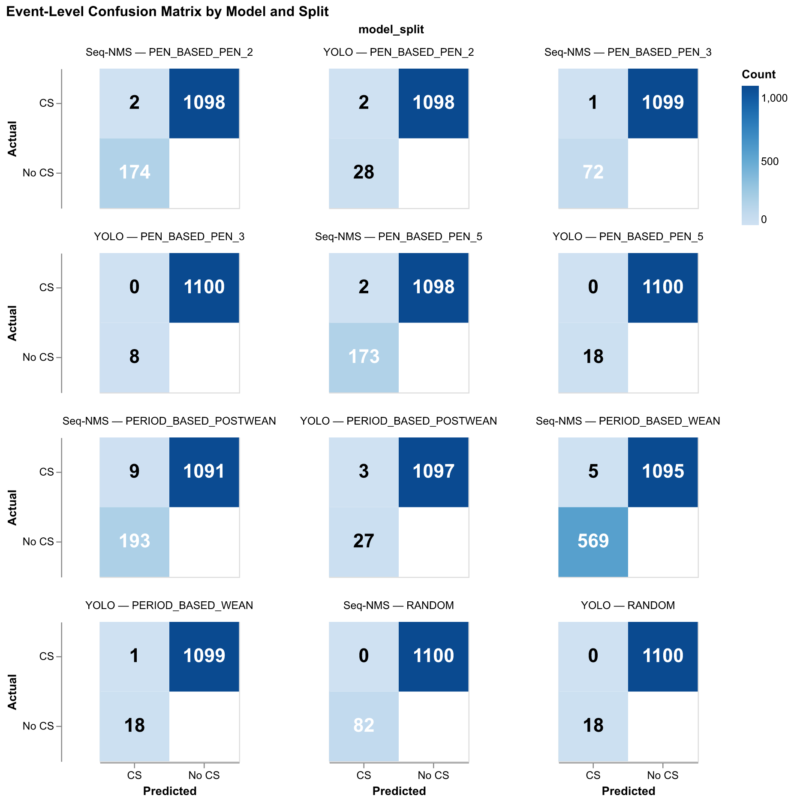
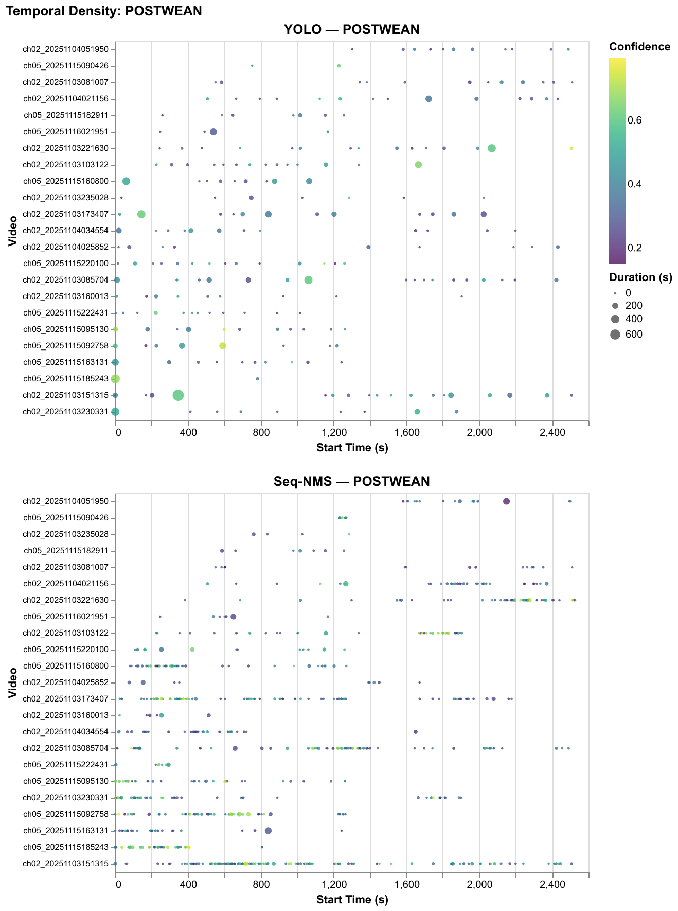
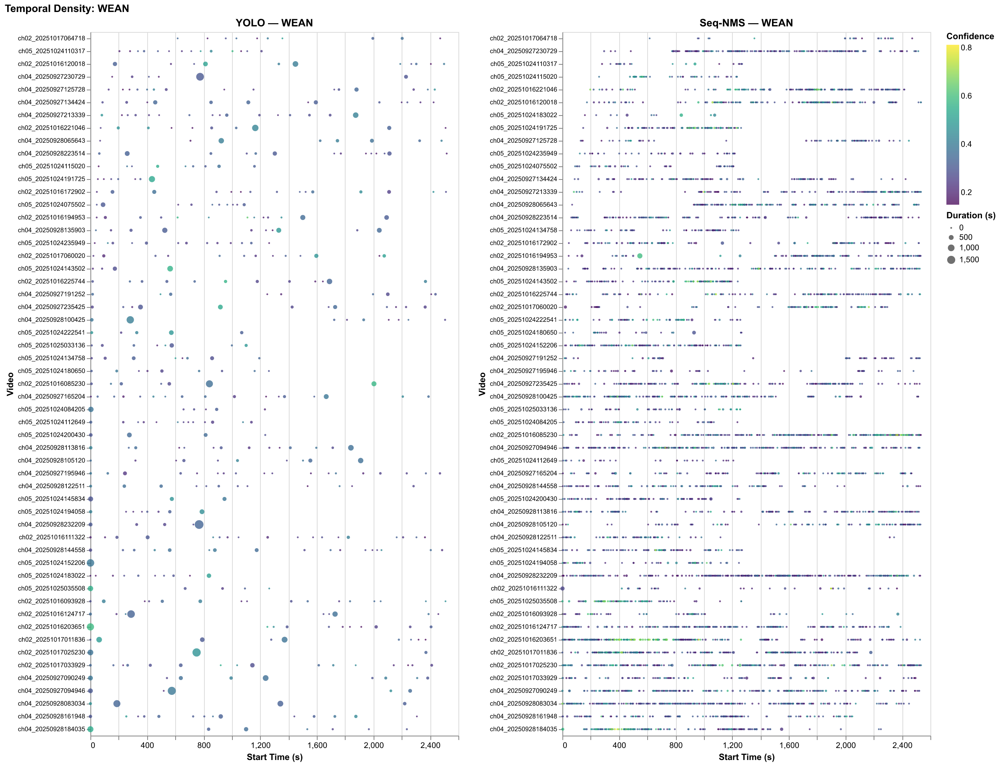
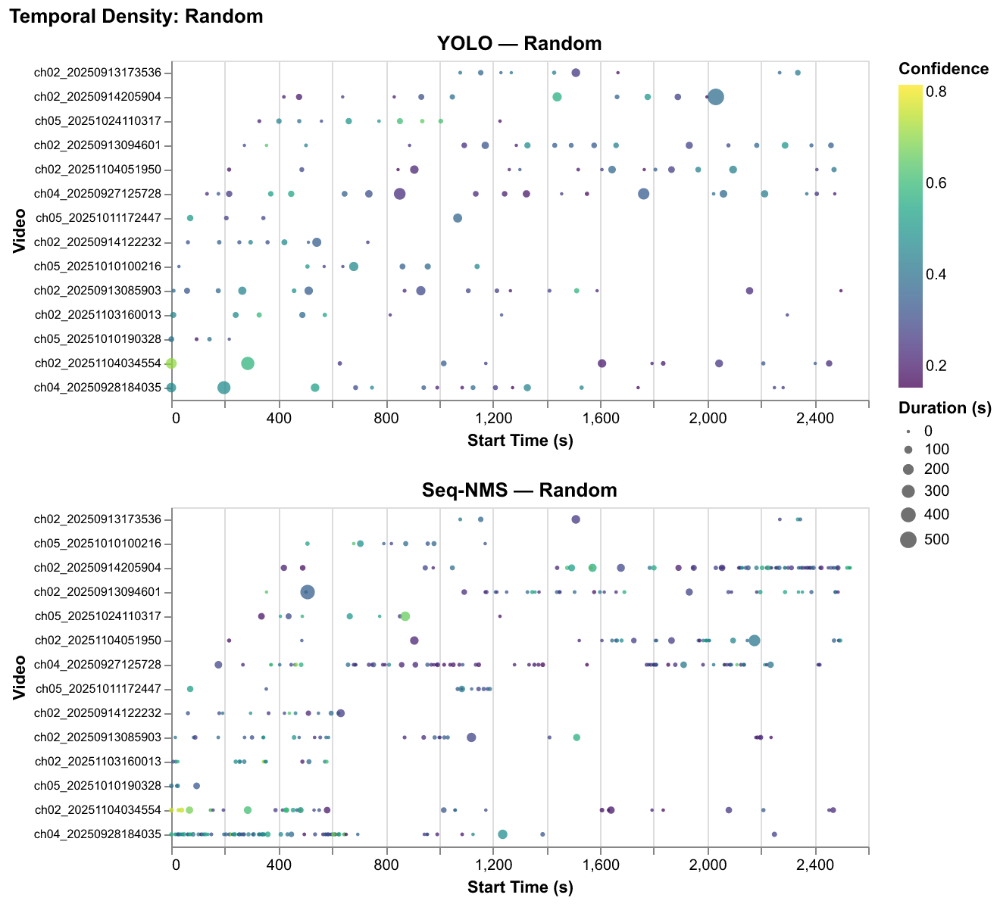



# Executive Summary

Dairy calves are typically separated from their mothers shortly after birth, and efforts to improve welfare through social housing are often limited by farmers' concerns about cross-sucking; a behaviour in which one calf sucks on the body parts of another, leading to injury, disease transmission, and reduced future milk production. With Canada's updated Code of Practice for Dairy Cattle requiring all indoor-housed calves to be socially housed by 4 weeks of age beginning April 1, 2031 [@weary2025social], addressing cross-sucking has become increasingly urgent. Research on cross-sucking is constrained by reliance on manual behavioural annotation, a process that is labour-intensive and difficult to scale. This project develops a computer-vision pipeline that automatically detects cross-sucking events in continuous barn camera footage, producing structured outputs including event timestamps, confidence scores, and bounding box coordinates, that directly reduce the manual annotation burden. Three approaches were evaluated: a pretrained YOLO26 baseline, a fine-tuned YOLO26 detector, and the fine-tuned detector extended with Sequential Non-Maximum Suppression (Seq-NMS). Seq-NMS detected more candidate cross-sucking events than YOLO26 alone in both test periods (Postwean: 820 vs. 238; Wean: 6,842 vs 554), though overall recall remained very low, with data volume identified as the primary bottleneck to further improvement.



# Introduction

In modern dairy farms, calves are often separated from their mothers within hours of birth [@mahmoud2016impacts; @wegner2025suckling] and housed individually [@gaillard2014]. Although individual housing may be easier to manage, social housing has been shown to improve calf welfare, including enhanced social cognition, cognitive development, learning ability, and reduced weaning distress [@plaugher2025]. Despite these benefits, many farmers remain reluctant to adopt social housing due to concerns surrounding cross-sucking [@plaugher2025].

Cross-sucking occurs when calves suck on the body parts of another calf, and in this project is defined specifically as sucking directed at the udder area. This behaviour emerges because calves are unable to satisfy their natural suckling instinct following mother-calf separation and therefore redirect this behaviour toward one another [@wegner2025suckling]. Cross-sucking can lead to physical injuries, disease transmission, and long-term reductions in future milk production [@mahmoud2016impacts], reinforcing concerns around social housing systems.

Currently, the UBC Animal Welfare Program (AWP) relies on manual labelling of extensive calf video recordings to study cross-sucking behaviour. This process is time-consuming, labour-intensive, and subject to inconsistencies between annotators, making it difficult to scale to larger datasets in commercial farming environments. This project aims to develop an affordable, automated system capable of detecting cross-sucking from continuous pen video, enabling more efficient, consistent, and scalable analysis of dairy calf behaviour in social housing systems.

Over the course of the project, the original objective was refined into four clear and measurable components: (1) develop a detection model that identifies cross-sucking behaviour in raw video through spatial localisation using bounding boxes; (2) implement a temporal linking method that groups frame-level detections into coherent behavioural events with defined start and end times; (3) design an evaluation framework that assesses both the spatial accuracy of bounding box predictions and the temporal accuracy of event detection; and (4) build an end-to-end pipeline that processes raw video and outputs structured metadata, including event timestamps, confidence scores, and bounding box coordinates, enabling use by non-technical users in research and farm environments.

The pipeline evaluates model performance at two levels. Frame-level evaluation asks whether the model's predicted bounding boxes align spatially with annotated cross-sucking regions. Event-level evaluation asks whether the model detected behavioural events at approximately the correct time, producing precision, recall, and F2 scores. Together, these objectives address the partner's core need: a scalable, automated tool that reduces the manual annotation burden while producing outputs that directly support behavioural research questions about when and how frequently cross-sucking occurs across different housing conditions and developmental stages.



# Data

The data for this project was gathered from video recordings of dairy calves in their pens at the UBC Dairy Farm across three consecutive days and three distinct weaning periods, spanning multiple calf pens. The initial dataset contained 1,036 source videos and 1,416 annotated cross-sucking clips. After filtering for clips present in OneDrive with matching annotation folders, the working dataset comprised 1,100 cross-sucking clips across 344 unique source videos, totalling over 300 GB of processed footage and over 1 TB including raw source video. Cross-sucking event frequencies varied substantially across environments, with Pen 5 exhibiting the highest event count and the post-weaning period the lowest, though missing post-weaning data for Pen 3 may confound this observation.

## Experimental Data Splits

To evaluate generalisation across deployment scenarios, the dataset was partitioned into eight train/validation splits across four experimental conditions. @tbl-splits summarises each split type, the number of models trained, and the research question each addresses.

```{python}
#| label: tbl-splits
#| tbl-cap: "Experimental train/test split design"

import pandas as pd
from IPython.display import display

splits = pd.DataFrame({
    "Split Type":        ["Random", "Time-based", "Pen-based", "Period-based"],
    "Models":            [1, 1, 3, 3],
    "Research Question": [
        "How well does the model perform when train\nand test come from the same distribution?",
        "How well does the model generalise to\nunseen days in a known environment?",
        "How well does the model transfer to\na new physical environment?",
        "How well does the model generalise across\ncalf developmental stage?",
    ]
})
display(splits)
```

## High-Performance Computing Workflow

Due to the size of the dataset and the number of parallel experiments, training was conducted on UBC ARC Sockeye. A key challenge was that YOLO26 training requires thousands of individual frame and label files, which HPC systems transfer inefficiently. The pipeline addresses this by extracting frames locally on each compute node, packaging them as compressed tar archives, and transferring archives rather than individual files to the scratch storage directory before unpacking for training. On Sockeye, all eight experimental splits were processed in parallel, reducing the total runtime from multiple weeks to approximately two days. Full operational details are provided in @sec-appendix-sockeye.



# Data Science Methods

Cross-sucking detection decomposes into two sub-problems: spatial detection, identifying where in a frame a cross-sucking event is occurring, and temporal linking, connecting frame-level detections into coherent behavioural events with defined durations. The pipeline addresses these sequentially across three model configurations.

## Baseline

The baseline uses [YOLO26](https://docs.ultralytics.com/models/yolo26) pre-trained on the [COCO dataset](https://docs.ultralytics.com/datasets/detect/coco) to detect calves and draw bounding boxes in each frame. For each frame, we compute the Intersection over Union (IoU) between every detected pair, as illustrated in @fig-baseline-iou. If any pair exceeds the minimum IoU threshold for at least a minimum duration, it is saved as a cross-sucking event; shorter sequences are discarded as noise.

{#fig-baseline-iou width=70%}

This approach is deliberately naive, using proximity as a proxy for cross-sucking with no understanding of what the behaviour actually looks like. Its value lies not in accuracy but in providing a reference point against which fine-tuned model improvements can be measured.

## Fine-tuned YOLO26 Model

To move beyond proximity detection, the pre-trained YOLO26 model was fine-tuned on labelled cross-sucking frames, with F2 score as the validation metric to prioritise recall over precision given the cost asymmetry between missed events and false alarms. The model learns the specific visual signatures of cross-sucking, postural configurations and spatial relationships that distinguish it from incidental contact.

A fundamental limitation remains: YOLO26 is a per-frame detector with no temporal memory. Cross-sucking unfolds over time, and a model without temporal context may produce fragmented detections across a sequence even when a single continuous event is occurring.

## YOLO26 and Seq-NMS

Sequential Non-Maximum Suppression (Seq-NMS) extends the fine-tuned YOLO26 pipeline with temporal linking. Per-frame detections are linked into event tubes by requiring spatial overlap between detections in consecutive frames, and tubes shorter than a minimum duration are discarded. Seq-NMS was preferred over more complex tracking algorithms because it is computationally lightweight, requires no additional learned components, and its output maps directly onto the ground truth annotation format. Its key limitation is sensitivity to per-frame detection quality — noisy detections cascade into fragmented tubes or missed events.

## Preliminary Experiment with Gemini

As a parallel experiment, Google Gemini 2.5 Flash was evaluated as a zero-shot multimodal detector to assess whether a large vision-language model could bypass the annotation bottleneck constraining supervised approaches. Two input modalities were tested: direct video input and frame-by-frame image input. Video input was identified as operationally superior, as each API call consumes the same quota unit regardless of clip length, making frame-by-frame processing unviable at barn surveillance scale. The prompt enforced a narrow behavioural definition requiring visible oral-to-hindquarter contact, explicitly excluding ear-sucking, social licking, and proximity without contact (full prompt in @sec-appendix-gemini).



# Data Product

{#fig-pipeline width=100%}

When deployed by a researcher or farm operator, the pipeline takes raw barn camera footage as input and requires no manual annotation or model training.

The footage is passed directly through the detection model, which produces per-frame bounding box predictions. These are then aggregated into discrete cross-sucking events with defined start and end times using the temporal linking step.

The resulting detections are written to structured JSON metadata files, one per source video, containing event timestamps, confidence scores, and bounding box coordinates.

An automated clip extraction tool then uses these outputs to pull and organise flagged video segments by pen, weaning stage, and recording day, giving researchers a condensed set of candidate clips for human review rather than hours of continuous footage.

The current pipeline offers three detection configurations of increasing sophistication: the COCO-pretrained proximity baseline, the fine-tuned YOLO26 detector, and the fine-tuned detector extended with Seq-NMS temporal linking. The research pipeline used to develop and evaluate these models on UBC ARC Sockeye is documented separately in the project repository and is not required for deployment.

This JSON-first, modular architecture was chosen because the research context demands interpretability over automation. Researchers need to verify detections rather than simply trust them, and the structured output gives them enough signal to prioritise which clips warrant immediate review based on confidence and duration. The annotated bounding box overlays further aid this process by making visible exactly what the model was responding to in each flagged segment, supporting a human-in-the-loop review workflow that fits naturally into the AWP's existing annotation practices.



# Results

```{python}
#| include: false

import json
import re
import pandas as pd
from pathlib import Path
import sys

project_root = Path().resolve().parent.parent
sys.path.insert(0, str(project_root))
from config import ROOT_DIR

EVAL_PATH = ROOT_DIR / "results" / "evaluation"

SPLITS = {
    "POSTWEAN": {
        "YOLO":    ROOT_DIR / "results" / "metadata" / "period_based" / "POSTWEAN" / "yolo",
        "Seq-NMS": ROOT_DIR / "results" / "metadata" / "period_based" / "POSTWEAN" / "seq-nms",
    },
    "WEAN": {
        "YOLO":    ROOT_DIR / "results" / "metadata" / "period_based" / "WEAN" / "yolo",
        "Seq-NMS": ROOT_DIR / "results" / "metadata" / "period_based" / "WEAN" / "seq-nms",
    },
    "Random": {
        "YOLO":    ROOT_DIR / "results" / "metadata" / "random" / "yolo",
        "Seq-NMS": ROOT_DIR / "results" / "metadata" / "random" / "seq-nms",
    },
}
SPLIT_ORDER = ["POSTWEAN", "WEAN", "Random"]
MODEL_ORDER = [f"{m} — {s}" for s in SPLIT_ORDER for m in ["YOLO", "Seq-NMS"]]

def _extract_pen(video_path):
    m = re.search(r"Pen\s*(\d+)", video_path, re.IGNORECASE)
    return f"Pen {m.group(1)}" if m else "Unknown"

def _extract_stage(video_path):
    for stage in ("PREWEANING", "WEANING", "POSTWEANING"):
        if stage.lower() in video_path.lower():
            return stage
    return "Unknown"

def load_predictions(input_dir, model_label):
    video_rows, event_rows = [], []
    for path in sorted(Path(input_dir).glob("*.json")):
        with open(path) as f:
            data = json.load(f)
        vid   = data["identifier"]
        pen   = _extract_pen(data.get("video_path", ""))
        stage = _extract_stage(data.get("video_path", ""))
        video_rows.append({
            "model": model_label, "video": vid, "pen": pen,
            "weaning_stage": stage,
            "total_duration_sec": data.get("total_duration_sec"),
            "cross_sucking_detected": data.get("cross_sucking_detected", False),
            "num_events": data.get("num_events", 0),
        })
        for i, ev in enumerate(data.get("events", [])):
            event_rows.append({
                "model": model_label, "video": vid, "pen": pen,
                "weaning_stage": stage, "event_idx": i,
                "start_sec": ev["start_sec"], "end_sec": ev["end_sec"],
                "duration_sec": ev["duration_sec"],
                "avg_confidence": ev["avg_confidence"],
            })
    video_df = pd.DataFrame(video_rows)
    event_df = pd.DataFrame(event_rows) if event_rows else pd.DataFrame(
        columns=["model","video","pen","weaning_stage","event_idx",
                 "start_sec","end_sec","duration_sec","avg_confidence"])
    return video_df, event_df

video_dfs, event_dfs = [], []
for split_name, models in SPLITS.items():
    for model_label, path in models.items():
        if not path or not Path(path).exists():
            continue
        vdf, edf = load_predictions(path, model_label)
        vdf["split"] = split_name
        edf["split"] = split_name
        video_dfs.append(vdf)
        event_dfs.append(edf)

all_video_df = pd.concat(video_dfs, ignore_index=True)
all_event_df = pd.concat(event_dfs, ignore_index=True)
all_event_df["model_split"] = all_event_df["model"] + " — " + all_event_df["split"]
all_video_df["model_split"] = all_video_df["model"] + " — " + all_video_df["split"]
all_event_df["short_name"]  = all_event_df["video"].str.replace(r"\.mp4$", "", regex=True)
all_video_df["short_name"]  = all_video_df["video"].str.replace(r"\.mp4$", "", regex=True)

def _parse_filename(filename):
    stem = Path(filename).stem
    m = re.match(r"evaluation_report_(.+?)_(yolo|seq_nms)$", stem)
    if not m:
        return {"split": stem, "model": "unknown"}
    return {"split": m.group(1), "model": m.group(2)}

def load_evaluation_folder(folder):
    rows = []
    for jf in sorted(Path(folder).glob("*.json")):
        with open(jf) as f:
            data = json.load(f)
        meta  = _parse_filename(jf.name)
        ev    = data.get("event_level", {})
        seq   = data.get("sequence_level", {})
        frame = data.get("frame_level", {})
        rows.append({
            "split":            meta["split"],
            "model":            meta["model"],
            "TP":               ev.get("true_positives",  0),
            "FP":               ev.get("false_positives", 0),
            "FN":               ev.get("false_negatives", 0),
            "precision":        ev.get("precision",  0.0),
            "recall":           ev.get("recall",     0.0),
            "f2":               ev.get("f2",         0.0),
            "avg_temporal_iou": seq.get("avg_temporal_iou", 0.0),
            "frame_bbox_iou":   frame.get("avg_bbox_iou",   0.0),
        })
    return pd.DataFrame(rows).sort_values(["split", "model"]).reset_index(drop=True)

eval_df = load_evaluation_folder(EVAL_PATH)
```

## Prediction Summary

```{python}
#| label: tbl-summary
#| tbl-cap: "Event-level detection statistics across splits and models"

summary = (
    all_event_df
    .groupby(["split", "model"])
    .agg(
        Events=("event_idx", "count"),
        Conf_Mean=("avg_confidence", "mean"),
        Conf_Std=("avg_confidence", "std"),
        Dur_Mean=("duration_sec", "mean"),
        Dur_Std=("duration_sec", "std"),
    )
    .round(3)
    .reset_index()
    .rename(columns={
        "split": "Split", "model": "Model",
        "Conf_Mean": "Conf. Mean", "Conf_Std": "Conf. Std",
        "Dur_Mean": "Dur. Mean (s)", "Dur_Std": "Dur. Std (s)",
    })
)
display(summary)
```

@tbl-summary summarises predicted event counts, mean confidence, and mean duration across splits and models. Three patterns are consistent across all splits. First, Seq-NMS predicts substantially more events than YOLO in every split: 820 vs 238 in POSTWEAN, 434 vs 162 in Random, and 6,842 vs 554 in WEAN. Second, Seq-NMS events are much shorter on average than YOLO events; in POSTWEAN for example, mean duration is 11.4s for Seq-NMS compared to 49.2s for YOLO. Third, both effects are most pronounced in the WEAN split, where Seq-NMS generates over 12 times more events than YOLO at the shortest mean duration (7.0s), while YOLO produces its longest mean events (131.3s). This is consistent with the Seq-NMS sequence-linking step breaking up what YOLO treats as one long sustained detection into many shorter linked segments, and suggests the WEAN period, where calves are in closer and more frequent proximity, is particularly prone to this behaviour.

## Confusion Matrix

{#fig-confusion width=100%}

@fig-confusion reveals the dominant failure mode: across every split and model, the vast majority of confirmed cross-sucking events are predicted as No CS, with true positive counts ranging from 0 to 9 out of 1,100 ground truth events. This confirms that both models are missing nearly all genuine cross-sucking occurrences rather than mislabelling other behaviours as cross-sucking.

Seq-NMS consistently recovered more true positives than YOLO in splits with confirmed signal, 9 vs 3 in POSTWEAN and 5 vs 1 in WEAN, confirming that temporal linking adds genuine recall value, but at a precision cost that is currently too high for unsupervised deployment (POSTWEAN: 193 vs 27 false positives; WEAN: 569 vs 18). Across all split types, neither model demonstrated reliable generalisation, whether to unseen days, new pen environments, or different developmental periods, suggesting that the limiting factor is not the experimental condition but the amount of labelled training data available.

That said, the project successfully delivered a functional end-to-end pipeline capable of processing raw barn video, applying frame-level detection, implementing temporal event linking, and producing structured JSON outputs with timestamps, confidence scores, and bounding box coordinates, directly addressing the AWP's need for a scalable and interpretable annotation tool.

## Temporal Analysis

{#fig-temporal-postwean width=100%}

{#fig-temporal-wean width=100%}

{#fig-temporal-random width=100%}

@fig-temporal-postwean, @fig-temporal-wean, and @fig-temporal-random show that across all splits, both models fire detections broadly across video timelines with no clear clustering around genuine behavioural bouts. The WEAN split is the most severely affected, with Seq-NMS generating 6,842 events, roughly 8 times the POSTWEAN count, at the lowest mean confidence (0.32) and shortest mean duration (7.0s), consistent with the linking step connecting many short detections during a period when calves are in closer and more frequent physical contact. The random split reinforces this interpretation, with zero confirmed true positives for either model and confidence distributions closely matching those of splits with genuine cross-sucking signal. Taken together, these results suggest the model has learned to detect generic calf proximity rather than cross-sucking behaviour specifically, firing with similar confidence whether or not a genuine event is present and failing to concentrate detections around the moments when cross-sucking actually occurs.



# Limitations

The confidence threshold of 0.5 was applied uniformly across all splits. Given the fine-tuned model's observed confidence distribution (mean 0.30–0.40), this threshold likely suppresses valid detections. Ground truth event counts of approximately 1,100 false negatives per split far exceed detected events, indicating the models miss the vast majority of cross-sucking occurrences rather than mislabelling them. The primary bottleneck is data volume: with fewer than 1,100 labelled positive clips and no hard negative examples, the model has insufficient signal to learn a reliable cross-sucking detector.

Additionally, YOLO26 is an object detector, not a behaviour recogniser, and holds independent knowledge of singular frames. With a dataset heavily impacted by occlusions and ambiguous interactions, the current modelling framework may be structurally limited in how much it can be improved without a change in architecture. Hyperparameter optimisation was also not performed; further tuning of confidence thresholds and training parameters may improve results.

Due to time constraints, deeper analysis into specific failure cases was not completed. EDA identified several expected challenges including occlusions, pattern blending, and unfavourable camera angles that likely inhibited detection. A more systematic error analysis would provide a clearer picture of the underlying limitations and guide future modelling decisions.



# Conclusions and Recommendations

A core outcome of this project is the development of a reproducible end-to-end pipeline for cross-sucking detection research, transforming raw barn video into structured event predictions through a standardised workflow for data processing, model training, inference, and evaluation. Although current detection performance is not yet sufficient for practical deployment, the underlying infrastructure is robust, reusable, and modular: researchers can replace the current detection models with more advanced architectures without rebuilding the surrounding data ingestion, preprocessing, evaluation, and reporting pipeline.

Neither model achieved practically useful recall in the current configuration. Ground-truth event counts of approximately 1,100 events per split substantially exceeded the number of detected events across all conditions, indicating that missed detections rather than misclassification remain the primary challenge.

For the AWP's immediate goal of reducing annotation burden, we recommend two targeted interventions before any infrastructure changes: expanding the training set with hard negative examples, footage of calves in close proximity that does not constitute cross-sucking, and lowering the confidence threshold with per-split retuning rather than applying a uniform cutoff.

Looking ahead, future work could include training with temporally-aware architectures such as YOWO or Swin Transformer, prediction smoothing for more stable frame-level annotation, and more comprehensive error analysis. Once detection performance reaches a practical threshold, additional engineering investments such as workflow monitoring, fault tolerance, and edge-device deployment can be considered.



# References

::: {#refs}
:::



# Appendix {#sec-appendix}

## Glossary of Terms {#sec-appendix-glossary}

**Cross-sucking event:** A single, continuous occurrence of cross-sucking behaviour performed by a calf, as identified and labelled by a human annotator. Each event has a defined start and end time within a source video.

**Event window:** The time interval defined by a start and end time in seconds over which a cross-sucking event occurs, applying to both ground truth and predicted events.

**Frame:** A single still image extracted from a video at a specific point in time.

**Frame-level detection:** A bounding box predicted by the model on an individual video frame indicating the location of a calf engaged in cross-sucking behaviour.

**Bounding box:** A rectangular region defined by pixel coordinates that marks the location of a cross-sucking interaction within a single frame.

**Frame-level evaluation:** Comparison of predicted bounding boxes against ground truth bounding boxes on a frame-by-frame basis, measuring spatial accuracy.

**Event-level evaluation:** Comparison of entire predicted event windows against ground truth event windows, measuring temporal detection accuracy and producing precision, recall, F1, and F2 scores.

**True positive:** A predicted event whose time window sufficiently overlaps with a labelled ground truth event.

**False positive:** A predicted event that does not correspond to any labelled ground truth event.

**False negative:** A labelled ground truth event that the model failed to detect.

**Ground truth:** The set of human-annotated cross-sucking events and bounding boxes treated as the correct reference for evaluation.

## Preprocessing on Sockeye {#sec-appendix-sockeye}

On Sockeye, preprocessing jobs are split across multiple nodes and run in parallel. For each node, video frames and labels are extracted locally, packaged as compressed tar archives, and transferred to a scratch storage node before being unpacked on compute nodes as training sets. This avoids transferring large numbers of small files and makes use of the high-speed transfer pathway for large archives. Training and evaluation also run across multiple nodes in parallel. In the local workflow, all steps run sequentially and data is written directly to the root directory without compression.

## Gemini 2.5 Flash Prompts {#sec-appendix-gemini}

**Video prompt:**

> You are an expert in dairy cattle behaviour. Identify cross-sucking in this video.
> Cross-sucking is defined narrowly: one calf sucking on the hind/rear back, udder, or lower
> stomach/belly area of another calf. It requires visible oral contact between one calf's mouth
> and that hindquarter region. Do NOT count sucking on any other body part (ears, muzzle, legs,
> etc.), and do NOT count mere proximity, sniffing, head-butting, or social licking. Analyse the
> video systematically. For every timestamp where cross-sucking occurs, return a 2D bounding box.
> Respond ONLY with a JSON array: `[{"timestamp_sec": <float>, "label": "cross-sucking",
> "box_2d": [ymin, xmin, ymax, xmax]}]`. If cross-sucking does not occur, return `[]`.

**Image prompt:**

> You are an expert in dairy cattle behaviour. Identify cross-sucking in this image.
> Cross-sucking is defined narrowly: one calf sucking on the hind/rear back, udder, or lower
> stomach/belly area of another calf. It requires visible oral contact between one calf's mouth
> and that hindquarter region. Do NOT count sucking on any other body part (ears, muzzle, legs,
> etc.), and do NOT count mere proximity, sniffing, head-butting, or social licking. If
> cross-sucking clearly occurs, return one tight 2D bounding box enclosing both the sucking calf
> AND the hindquarter area being sucked, labelled 'cross-sucking'. Respond ONLY with a JSON
> array: `[{"label": "cross-sucking", "box_2d": [ymin, xmin, ymax, xmax]}]`.
> If cross-sucking does not clearly occur, return `[]`.
