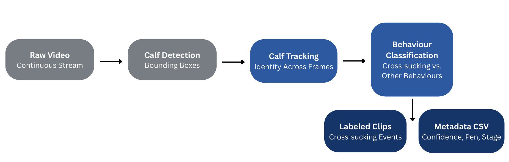

# Executive Summary

Dairy calves are generally separated from their mothers shortly after birth. Attempts towards improving calf welfare through social housing are blocked by farmers' fears of economic repercussions due to bodily harm, disease and impact on milk production caused by cross-sucking. Studying this behaviour is challenging as the current process involves manual labelling that is laborious, time-inefficient, and unscalable. This project aims to use a computer-vision-based approach to automatically detect and label cross-sucking behaviour in dairy cows for improved scalability and efficiency.

# Introduction

In modern dairy farms, calves are commonly separated from their mothers within hours after birth (@mahmoud2016impacts; @wegner2025suckling) and kept in individual pens (@gaillard2014). While individual housing may be easier to manage, social housing has been shown to improve calves’ welfare, including improved social cognition, cognitive ability, learning ability, and lowered weaning distress (@plaugher2025). Despite these advantages, farmers are hesitant to adopt social housing due to concerns about cross-sucking (@plaugher2025).

Cross-sucking occurs when one or more calves are sucking on any body parts of another calf. However, in this project, cross-sucking is considered specifically as the sucking of the udder area. As calves are unable to fulfill their natural desire to suckle due to mother-calf separation, calves often redirect this behaviour to suck (@wegner2025suckling). Cross-sucking can potentially cause physical injuries, disease transmission, and long-term impacts on future milk production  (@mahmoud2016impacts). Therefore, cross-sucking becomes a barrier to wider social housing adoption, highlighting the need for further research to address farmers’ concerns and improve calf welfare.

Currently, the UBC Animal Welfare Program (AWP) relies on manual labelling of extensive video recordings of calves to study cross-sucking. This approach is time-consuming, laborious, and inconsistent for each annotator, causing difficulty in scaling to larger datasets in commercial farms. This project aims to deploy an affordable, automated system that detects cross-sucking from live video, enabling a more efficient, consistent, and scalable analysis of dairy calves’ behaviour in social housing.

# Data & Exploratory Data Analysis (EDA)

## Data Source (from Sarah Keppler’s description of data collection)

Our dataset consists of raw video footage, including twenty-four-hour recordings of dairy calves in their pens, shorter clips capturing cross-sucking behaviour, and labelled versions of these clips. Each pen is recorded from a single camera at an angled overhead view.

The raw footage was collected from three groups of dairy calves (eight calves per pen) over three consecutive days during each of three observation periods: pre-weaning, weaning, and post-weaning. Throughout these periods, calves were monitored for cross-sucking behaviour.

The recordings were then reviewed manually by undergraduate students, who examined 27 days of footage (3 pens, 3 periods, 3 days each) to identify cross-sucking events and extract them into shorter clips. These clips were subsequently reviewed again, and the cross-sucking behaviours were manually labelled. As expected, this data collection process required several months to complete, highlighting the need for a more efficient approach.

## Observational Unit

The observational unit was each video clip extracted from continuous recordings, with each clip containing at least one cross-sucking event. @fig-data-table shows a breakdown of these clips.

{#fig-data-table width=75%}

@fig-histogram below shows the length of cross-sucking events based on the duration of clipped videos. From this, we can gather that most cross-sucking events are relatively short, 51s on average, or with a median value of 23.8s. The shortest cross-sucking event is 0.3s, and the longest is 791s (~13mins).

{#fig-histogram width=75%}

## Anticipated Challenges

 Based on our dataset, we expect to face several key modelling challenges. Pens are crowded environments, and cross-sucking behaviour frequently occurs in areas where calves or structural beams partially occlude one another, making it difficult to clearly observe key visual features. Additional challenges include varying lighting conditions, labelling inconsistencies, similar coat patterns between calves, multiple cross-sucking events occurring simultaneously, and differing orientations of these behaviours. Together, these conditions make it difficult for the model to accurately detect true cross-sucking events and distinguish them from other interactions. 

{#fig-anticipated-challenges width=75%}

Temporal modeling introduces an additional layer of complexity due to variations in clip length.  Shorter clips may show partial cross-sucking events, providing incomplete behavioural context.. Conversely, longer clips require the model to track cross-sucking behaviours over long periods of time, increasing the difficulty of consistent detection. Together these characteristics motivate the need for models able to handle the robust spatial, and temporal challenges present in our data. [@fig-anticipated-challenges] shows several of these challenges.

## Limitations

There is a limited number of pen styles, camera angles, and cows, resulting in the potential of our model failing to generalize well to outside environments. Data is also restricted to video labelled with bounding boxes; there may be alternative approaches that provide better solutions (infrared, skeletal structures, etc.).

# Data Science Approach

To prevent data leakage, we hold out one full pen as our test set, using a provided mapping file to identify all associated clips. This is preferable to a day-level split given that Pen 3 has little to not post-weaning data, making a weaning-stage-stratified split difficult to balance across all pens.
Our methodology follows a progressive three-phase structure: establish a working baseline, refine frame-level detection, then introduce temporal reasoning.
Baseline: Proximity-Based Detection with Pre-Trained YOLO
We begin with two out-of-the-box detectors to establish a benchmark — YOLOv7X pretrained on a 428-image cattle body part dataset achieving 99.6% mAP (@khalili2023; @wang2023), and YOLOv8 pretrained on COCO which detects whole-cow bounding boxes. We apply a proximity check using sub-regions of each detected box — the top 25% as a head proxy and the bottom 25% as a udder proxy — flagging frames where the head region of one calf overlaps the udder region of another as a candidate cross-sucking event. Overlap must persist across a minimum number of consecutive frames to suppress false positives from calves simply standing near each other.

IMAGE 1

IMAGE 2

IMAGE 3

A key limitation is anatomical imprecision — whole-cow boxes and coarse body part proxies may generate false positives, directly motivating our refined detection methods below.

## Refined Frame-Level Detection

To address the domain gap, we will fine-tune on our own annotated pen footage, introducing dedicated mouth and udder classes to make the proximity check anatomically precise. We evaluate three candidate approaches from simplest to most complex:

TABLE 1

Anticipated challenges include class imbalance and annotation cost, since fine-tuning requires sufficient labelled positive frames across all three weaning stages.

## Temporal Approaches

With a reliable per-frame signal established, we layer temporal reasoning on top to distinguish sustained sucking events from brief incidental contact. We evaluate three architectures of increasing complexity:

TABLE 2

A key challenge across all temporal approaches is that we may not have enough labelled cross-sucking clips to train these models reliably. Our footage is spread across three weaning stages and seven days, which means each stage has relatively few positive examples to learn from. To compensate, we will use data augmentation techniques — artificially generating new training samples by simulating blocked views, randomly shifting clips in time, and adding motion blur — to give the model more variety without collecting additional footage.

# Evaluation & Success Criteria

## Evaluation Metrics

To evaluate our detection system, we will use metrics across two levels. 
At the event level, bounding box IoU will be used to measure how precisely 
predicted boxes overlap with ground truth annotations, while precision, 
recall, F1, and F2 will assess how well the model classifies cross-sucking 
versus similar behaviours like grooming or head-butting. We will prioritize 
F2 over F1 as missing a cross-sucking event is more costly than an occasional 
false positive. At the sequence level, temporal IoU will measure how accurately 
the model captures the full duration and timing of each detected event against 
manually labeled time windows.

## Success Criteria

Success for our partner means more than strong metric scores. The system must 
function as a deployable workflow that accepts continuous raw video and 
automatically generates labeled clips alongside metadata including confidence 
scores, pen number, weaning stage, and event duration. This will enable 
researchers to ask deeper questions such as whether cross-sucking prevalence 
varies across pens or developmental stages. Success also requires the pipeline 
to be accessible to non-technical users via Docker, with outputs mirroring the 
existing CSV annotation structure for immediate integration into current workflows.

{#fig-pipeline fig-align="center" width=85%}

See @fig-pipeline for a high level overview of the system pipeline.

## Practical Use & Stakeholders

In practice, results will be used in two ways. For researchers, the system 
enables large-scale behavioral monitoring across Canadian dairy farms, supporting 
the first comprehensive risk factor analysis of cross-sucking prevalence and 
informing best management practices ahead of the 2032 Canadian regulation 
requiring social housing of dairy calves. For farmers, it provides a practical 
tool to evaluate whether management changes such as adjusting feeding methods 
or milk quantities are reducing cross-sucking.

The primary stakeholders are UBC Animal Welfare Program researchers, who require 
a rigorous and reproducible tool, and Canadian dairy farmers, who need something 
practical and easy to deploy. Secondary stakeholders include the broader animal 
welfare research community, who will benefit from the open-sourced pipeline.